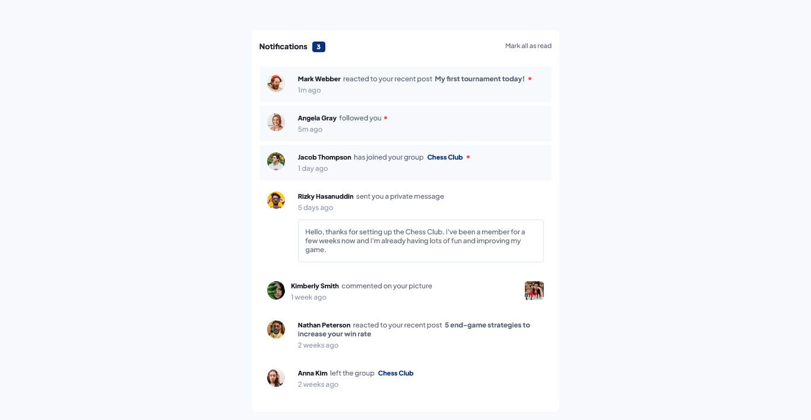

# Frontend Mentor - Notifications page solution

This is a solution to the [Notifications page challenge on Frontend Mentor](https://www.frontendmentor.io/challenges/notifications-page-DqK5QAmKbC). Frontend Mentor challenges help you improve your coding skills by building realistic projects.

## Table of contents

- [Overview](#overview)
- [The challenge](#the-challenge)
- [Screenshot](#screenshot)
- [Links](#links)
- [My process](#my-process)
- [Built with](#built-with)
- [Author](#author)
- [Acknowledgments](#acknowledgments)

## Overview

- HTML: The HTML file (index.html) defines the structure of the notifications page. It includes sections for the header, notifications container, and a toggle button for marking all messages as read. Each notification is represented as a 
 element with appropriate classes and attributes for styling and interactivity.

- CSS: The CSS file (styles.css) contains the styles and layout rules for the notifications page. It uses CSS variables to define the color palette, font styles, and other reusable properties. The styles are organized using class selectors to target specific elements and apply desired visual effects.

- JavaScript: The JavaScript code is written in the [<script>] tag within the HTML file. It starts by selecting the necessary elements from the page using query selectors. Then, it adds event listeners to handle user interactions. The code counts the number of unread messages, updates the count when a message is marked as read, and provides a function to mark all messages as read.

### The challenge

Users should be able to:

- Distinguish between "unread" and "read" notifications
- Select "Mark all as read" to toggle the visual state of the unread notifications and set the number of unread messages to zero
- View the optimal layout for the interface depending on their device's screen size
- See hover and focus states for all interactive elements on the page

### Screenshot

### Links

- Solution URL: ( https://www.frontendmentor.io/solutions/notifications-page-using-flexbox-CVaD_BKqyW)
- Live Site URL: (https://notifications-page-rho-ebon.vercel.app/)

## My process

The process of creating the Notifications Page involved the following steps:

- Design: The initial design and layout for the notifications page were provided by Frontend Mentor. This design served as the starting point for building the page.

- HTML Structure: The HTML structure was created to define the overall layout of the notifications page. The necessary elements, such as the header, notifications container, and toggle button, were included.

- CSS Styling: The CSS file was developed to apply styles to the HTML elements and achieve the desired visual appearance. CSS variables were used to define the color palette and font styles for easy customization.

- JavaScript Interactivity: JavaScript code was added to make the notifications page interactive. Event listeners were attached to handle user actions, such as clicking on a notification to mark it as read or clicking the "Mark all as read" button. The code dynamically updates the unread message count and applies appropriate styling changes to the notifications.

- Testing and Refinement: The notifications page was tested in different web browsers and screen sizes to ensure compatibility and responsiveness. Any bugs or issues were identified and fixed during this stage. The code was refined for optimal performance and maintainability.

### Built with

- Semantic HTML5 markup
- CSS custom properties
- Flexbox
- CSS Grid
- Mobile-first workflow
- Vanilla JavaScript

## Author

- Frontend Mentor - [@dirudeen](https://www.frontendmentor.io/profile/dirudeen)
- Twitter - [@deenboi22](https://www.twitter.com/deenboi22)

## Acknowledgments

I would like to express my sincere appreciation to Fronted-Mentor for providing me with the invaluable opportunity to utilize their projects for practice and skill development as a frontend engineer. I am particularly grateful for the opportunity to receive feedback and learn from experienced mentors and fellow developers within the Fronted-Mentor community. The constructive criticism and encouragement have motivated me to constantly improve my work and strive for excellence. I am truly thankful for the exceptional learning and growth opportunities provided by Fronted-Mentor. It has been an invaluable resource for my professional development, and I am sincerely grateful for their commitment to nurturing the next generation of frontend developers.
